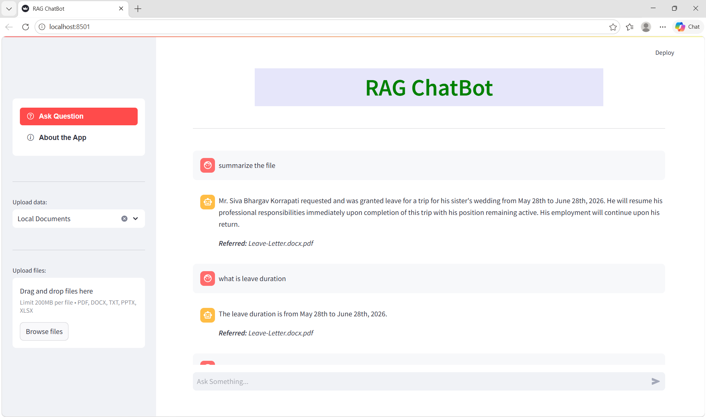

# RAG Chatbot 
An AI-powered Retrieval-Augmented Generation (RAG) chatbot that allows users to upload documents and ask questions based on their content.

## Features

-  Upload documents (PDF, DOCX, TXT, PPTX, XLSX)
-  Semantic search using FAISS
-  Context-aware answers using LLM
-  FastAPI backend + Streamlit frontend
-  Secure API key handling with `.env`
-  Multi-format document ingestion

##  Architecture

User → Streamlit UI → FastAPI →  
Document Loader → Chunking → Embeddings → FAISS →  
Query → Similarity Search → LLM → Response


## Tech Stack

- Python
- FastAPI
- Streamlit
- LangChain
- OpenAI API
- FAISS


## My Contributions

- Built full-stack RAG system from scratch
- Integrated document loaders + embeddings + vector search
- Debugged API errors, quota issues, and module imports
- Implemented secure environment variable handling
- Designed frontend workflow for file upload & quering

## Demo

Here is the working RAG chatbot UI:




## Setup Instructions

```bash
# 1. Clone repo
git clone <your-repo-link>
cd RAG-chatbot

# 2. Create virtual environment
python -m venv venv
venv\Scripts\activate   # Windows

# 3. Install dependencies
pip install -r requirements.txt

# 4. Add API key
Create .env file:
OPENAI_API_KEY=your_key_here

# 5. Run backend
uvicorn backend.app:app --reload

# 6. Run frontend
streamlit run frontend/main.py


